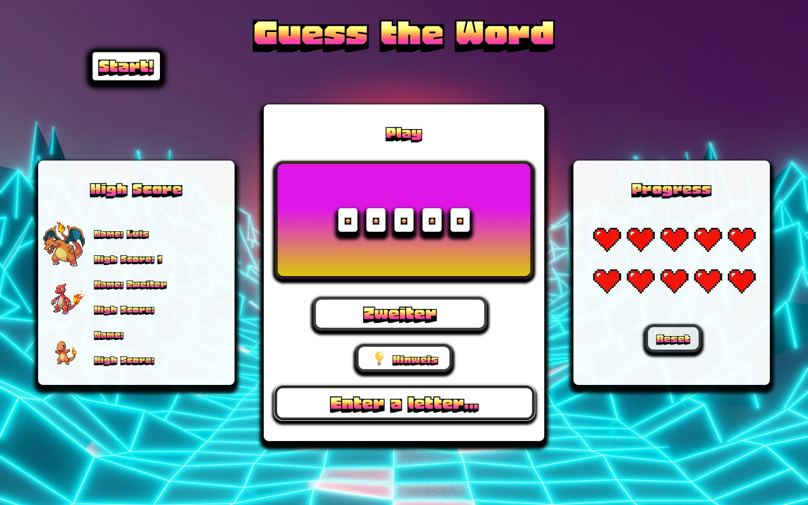

# Wortraten-Spiel – „Guess the Word"

Ein Browser-Wortratespiel im Stil von Galgenmännchen, gebaut mit reinem HTML, CSS und JavaScript – ohne Frameworks oder Build-Schritt. Entstanden als Uni-Projekt.

**▶ Live spielen: https://lui5380s.github.io/Wortraten-Spiel/**



## Spielablauf

1. Namen eingeben und auf **Start!** klicken.
2. Das Spiel wählt ein zufälliges Wort aus einer von vier Kategorien (Früchte, Sport, Automarken, Musikrichtungen) und zeigt einen Hinweis dazu an.
3. Buchstaben einzeln eingeben – jeder richtige Buchstabe wird im Wort aufgedeckt.
4. Jeder falsche Buchstabe kostet ein Herz. Du hast 10 Leben.
5. Für jedes erratene Wort gibt es einen Punkt und ein neues Wort. Sind alle Herzen weg, ist das Spiel vorbei und du siehst, wie viele Wörter du erraten hast.

## Funktionen

- **Highscore-Liste** mit den drei besten Spielern der aktuellen Sitzung, automatisch sortiert
- **10 Leben** als animierte Pixel-Herzen
- **Hinweise** zu jedem Wort – über den 💡-Button jederzeit erneut abrufbar
- **Soundeffekte** für richtige und falsche Eingaben und gelöste Wörter
- **PokéAPI-Anbindung**: Die Sprites neben der Highscore-Liste werden live von der [PokéAPI](https://pokeapi.co/) geladen

## Starten

Keine Installation nötig:

```bash
git clone https://github.com/Lui5380s/Wortraten-Spiel.git
cd Wortraten-Spiel
```

Dann `index.html` im Browser öffnen. Für die PokéAPI-Sprites wird eine Internetverbindung benötigt.

## Projektstruktur

```
index.html     Aufbau der Seite (Anleitung, Highscore, Spielfeld, Leben)
index.css      Styling
index.js       Spiellogik: Eingabe, Buchstabenprüfung, Leben, Punkte
functions.js   Hilfsfunktionen: Reset, Highscore, Sortierung, API-Aufrufe
wortwahl.js    Wortlisten mit Hinweisen und zufällige Wortauswahl
assets/        Hintergrundbild, Herz-Grafik, Favicon, Screenshot
sounds/        Soundeffekte
```

## Credits

- Hintergrundbild: [Neeqolah Creative Works](https://unsplash.com/@neeqolah) auf Unsplash
- Soundeffekte: [Mixkit](https://mixkit.co/free-sound-effects/)
- Pokémon-Sprites: [PokéAPI](https://pokeapi.co/)
- Schriftart: [Honk](https://fonts.google.com/specimen/Honk) via Google Fonts

## Lizenz

[MIT](LICENSE)
